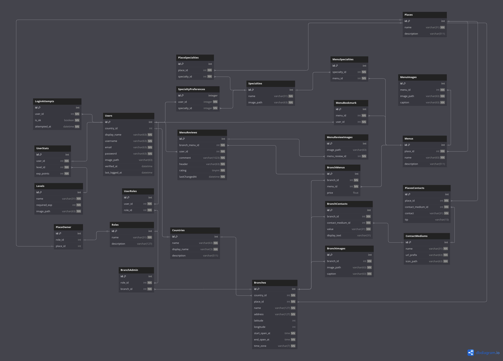

# Gourmets
Gourmets provides you all sort of informations on places with vast selection 
of delicacies you could enjoy. Be it food or drinks, Gourmet provides them all~

> **Table of Contents**
> - [Features](./#features)
> - [Techicals](./#technicals)
>   * [Tech Stack](./#tech-stack)
>   * [Schema](./#schema)

    
## Features

### 🧭 Enrich your insight of the world of culinary!
Find and explore new places to try! Want to know more about a place? Simply post your 
question in the place's forum!

### 🍜 Make your next gastronomy journey happen!
Got a place in mind? With Gourmets, you could reserve the place for you to visit on later!

### 💭 Join the community!
Leave your thoughts and rating about a place you would like others to know! Who knows you
would find hidden gem you probably never discovered yet~

## Technicals

### Tech Stack
 

### Schema 

